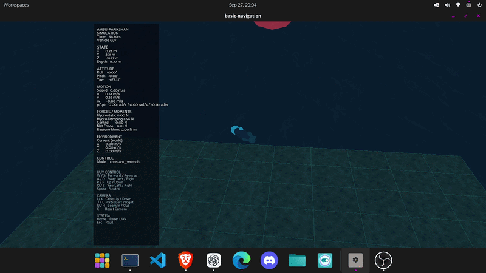

# **Ambu-Parikshan**

### अम्बुपरीक्षण · HydroLab-3D v1.0


**A lightweight, deterministic 3D marine-robotics simulator for 6-DOF UUV dynamics, sensing, control, geometric environments, and constrained multi-UUV experiments.**

Developed by **Peacock Dynamics**.

---

## Abstract

**Ambu-Parikshan** is a simulation-first marine robotics application built on the validated **HydroLab-3D v1.0** computational core. It provides a compact, reproducible environment for experimenting with six-degree-of-freedom (6-DOF) Uncrewed Underwater Vehicle (UUV) motion, water-relative hydrodynamics, gravity and buoyancy, generalized actuator wrenches, ocean currents, sensor observations, closed-loop control, geometric worlds, and deterministic multi-UUV communication constraints.

The project deliberately uses selective fidelity. It models the engineering relationships needed for control, navigation, autonomy, learning interfaces, and simulation experiments without claiming CFD, detailed acoustics, contact mechanics, or hardware equivalence. The public application layer handles YAML scenarios, runtime orchestration, logging, metrics, and optional Panda3D visualization; the `hydrolab3d` namespace owns physical simulation semantics.

Ambu-Parikshan 0.1.0 is the first packaged application baseline. Its HydroLab-3D core preserves the executed notebook lineage and its historical regression suite, while the surrounding application makes those validated models usable through reproducible scenarios and a lightweight engineering visualizer.

---

## Table of Contents

- [Introduction](#introduction)
- [How We Built It](#how-we-built-it)
- [Physics and Simulation Model](#physics-and-simulation-model)
- [Architecture](#architecture)
- [Repository Structure](#repository-structure)
- [Install and Run](#install-and-run)
- [Output and Lightweight Simulator](#output-and-lightweight-simulator)
- [Implemented Capabilities](#implemented-capabilities)
- [Conclusion and Immediate Use](#conclusion-and-immediate-use)
- [Future Expansion: MultiUUV-Link](#future-expansion-multiuuv-link)
- [Limitations and Validation Status](#limitations-and-validation-status)
- [Organization](#organization)
- [License](#license)

---

# Introduction

Marine autonomy needs an environment in which vehicle motion, sensing, environmental effects, and control can be studied together before costly field trials. Ambu-Parikshan provides that environment while preserving a clean separation between application concerns and the simulation core:

```text
Ambu-Parikshan
scenario configuration · runtime · logging · visualization
        │
        ▼
HydroLab-3D v1.0
6-DOF vehicle dynamics · sensors · world · communication
```

The project uses the convention `+X` forward, `+Y` lateral, and `+Z` upward. A vehicle pose is `[x, y, z, roll, pitch, yaw]`; depth is therefore `-z`. All vehicle commands pass through the same body-frame generalized wrench interface:

```text
[Fx, Fy, Fz, Mx, My, Mz]
```

This makes manual input, waypoint control, external algorithms, and future adapters use the same validated physics path.

# How We Built It

The basic prototype was developed and executed incrementally in twelve Jupyter notebooks. They remain in `notebooks/` as engineering evidence and are the authoritative lineage for the validated core:

| Notebook | Validated layer |
| --- | --- |
| `00`–`01` | 3D kinematics, orientation, frames, and transforms |
| `02`–`04` | rigid-body dynamics, drag, gravity, buoyancy, CG/CB restoring effects |
| `05`–`06` | thrusters, saturation, forces/moments, and ocean currents |
| `07` | integrated 6-DOF UUV dynamics |
| `08` | IMU, depth, DVL, heading, noise, bias, and seeded reproducibility |
| `09` | PID depth, heading, and waypoint control |
| `10` | fixed-step `Simulator.reset()` / `Simulator.step()` kernel |
| `11` | truth/observation separation and learning-interface validation |

After notebook validation, the code was promoted into the `src/` package layout without replacing the notebook-derived numerical behavior. The current suite contains **226 passing tests**, including the historical **167-test** HydroLab-3D regression baseline.

# Physics and Simulation Model

HydroLab-3D propagates the standard selective-fidelity 6-DOF marine vehicle formulation:

$$
M\dot{\nu} + C(\nu)\nu + D(\nu_r)\nu_r + g(\eta) = \tau + \tau_{env},
$$

with kinematics:

$$
\dot{\eta}=J(\eta)\nu.
$$

Here, $\eta$ is world-frame pose, $\nu$ is body-frame velocity, $M$ includes rigid-body and added mass terms, $C$ contains Coriolis effects, $D$ contains linear and quadratic hydrodynamic damping, and $g$ contains gravity, buoyancy, and restoring moments from the centres of gravity and buoyancy.

The model includes:

- body/world transformations using $R_z(\text{yaw})R_y(\text{pitch})R_x(\text{roll})$;
- water-relative hydrodynamics, with world currents transformed into body coordinates;
- generalized thruster forces and moments with saturation;
- explicit-Euler fixed-step propagation;
- depth, heading, DVL, gyroscope, and accelerometer observations with optional noise and bias;
- PID-based depth, heading, and waypoint control;
- flat/height-field seabeds, bounded volumes, sphere/box obstacle queries, and lightweight geometric sonar;
- deterministic multi-UUV stepping, communication range/latency/loss/blackouts, and scheduled actuator faults.

This is a lightweight research model, not a claim of high-fidelity hydrodynamic or acoustic reproduction.

# Architecture

```text
scenario.yaml
     │
     ▼
ambu_parikshan
configuration · runtime · action sources · logs · optional renderer
     │
     ▼
hydrolab3d
Simulator · UUV dynamics · sensors · world geometry · communication
```

The dependency direction is intentionally one-way:

```text
ambu_parikshan → hydrolab3d
```

`hydrolab3d` does not depend on the application or renderer. The Panda3D visualizer receives copied state snapshots; it never integrates physics or writes vehicle truth.

# Repository Structure

```text
Ambu-Parikshan/
├── assets/
│   ├── media/                 # GitHub README GIF and project media
│   └── textures/              # Seabed and water visual textures
├── examples/                  # Public API examples
│   ├── manual_control.py
│   ├── multi_uuv_demo.py
│   └── waypoint_control.py
├── notebooks/                 # Executed HydroLab-3D validation lineage (00–11)
├── results/                   # Experiment and notebook result artifacts
├── scenarios/                 # Runnable YAML simulation scenarios
│   ├── basic_navigation.yaml
│   ├── current_test.yaml
│   ├── waypoint_navigation.yaml
│   └── multi_uuv.yaml
├── src/
│   ├── ambu_parikshan/        # Application, CLI, runtime, logging, renderer
│   └── hydrolab3d/            # Validated simulation core and API
├── tests/                     # Historical and application regression tests
├── .github/workflows/         # Continuous-integration test workflow
├── pyproject.toml             # Packaging, version, dependencies, CLI entry point
├── requirements.txt           # Development/environment dependency reference
└── README.md
```

The notebook files are retained as validation evidence. Generated caches and
local run artifacts are not part of the public source contract.

# Install and Run

## Headless installation

```bash
python -m pip install --no-build-isolation -e .
python -m pytest -q
```

## Headless scenarios

```bash
ambu-parikshan run scenarios/basic_navigation.yaml --headless
ambu-parikshan run scenarios/current_test.yaml --headless
ambu-parikshan run scenarios/waypoint_navigation.yaml --headless
ambu-parikshan run scenarios/multi_uuv.yaml --headless
```

Headless logging is optional and writes `run_metadata.json` and `trajectory.csv`:

```bash
ambu-parikshan run scenarios/basic_navigation.yaml --headless \
  --output results/runs/basic-navigation
```

## Optional interactive visualization

```bash
python -m pip install -e ".[visualization]"
ambu-parikshan run scenarios/basic_navigation.yaml --render
```

Interactive controls:

| Group | Controls |
| --- | --- |
| UUV | `W/S` forward/reverse · `A/D` sway · `R/F` up/down · `Q/E` yaw · `Space` neutral |
| Camera | `I/K` orbit up/down · `J/L` orbit left/right · `U/H` zoom · `C` reset camera |
| System | `Home` reset UUV · `Esc` quit |

# Output and Lightweight Simulator

The optional Panda3D engineering visualizer renders a procedural low-poly UUV, world axes, textured seabed and water-surface cues, obstacles, a fixed telemetry panel, and keyboard orbit-camera controls. It is presentation-only: the fixed-step simulator remains the sole owner of truth propagation.

<!-- Add assets/media/ambu-parikshan-demo.gif before publishing. -->


The visualizer has been manually exercised on a Pop!_OS desktop. It is not a photorealistic ocean renderer and does not model waves, refraction, shadows, or detailed terrain meshes.

# Implemented Capabilities

- packaged Python `src/` layout with CLI entry point: `ambu-parikshan`;
- deterministic headless single-UUV scenarios and reproducible sensor noise;
- YAML configuration validation and CSV/JSON experiment artifacts;
- constant-wrench, zero-action, and notebook-derived waypoint control modes;
- world bounds, water surface, seabed queries, obstacles, and lightweight sonar;
- optional engineering Panda3D visualization and manual wrench control;
- interactive geometry look-ahead assistance that blocks an action component aimed at nearby geometry without adding contact forces;
- deterministic fleet primitive, range-limited communication, packet latency/loss/blackouts, and scheduled wrench-fault scenarios;
- lightweight reusable metrics for trajectories, tracking, control effort, separation, and communication delivery.

# Conclusion and Immediate Use

Ambu-Parikshan 0.1.0 turns the validated HydroLab-3D notebook work into a usable simulator application. It is intended for repeatable UUV-control, navigation, sensing, and algorithm-interface experiments before integration with external autonomy stacks or hardware. Immediate use is through the shipped YAML scenarios, headless experiment logs, and the optional interactive viewer for engineering inspection and manual control.

# Future Expansion: MultiUUV-Link

The immediate next use of Ambu-Parikshan is as the 3D physical simulation foundation for **MultiUUV-Link**. MultiUUV-Link studies decentralized mission autonomy under partial perception, limited communication, safety constraints, and vehicle failures. Ambu-Parikshan will provide vehicle motion, sensors, geometric context, and constrained communication instrumentation; the MultiUUV-Link autonomy layer will remain responsible for agent-local memory, decision making, task allocation, and knowledge exchange. This preserves the principle that an individual agent's knowledge need not equal simulator ground truth.

# Limitations and Validation Status

| Area | Status |
| --- | --- |
| Notebook-derived HydroLab-3D dynamics | validated by historical automated regression tests |
| Application scenarios, logging, fleet, communication, faults | automatically tested |
| Panda3D visualizer | implemented, automated helper coverage, and manually exercised on a Pop!_OS desktop |
| ROS 2 | import-isolated conversion helpers only; no ROS node/transport or live ROS validation |
| Hydrodynamics | selective-fidelity model; no CFD or hardware equivalence claim |
| Sonar | lightweight geometric range/bearing query; not acoustic propagation |
| Collisions | query/navigation-assistance behavior; no contact impulses, damage, or rigid-body response |

Known numerical/model boundaries include explicit-Euler integration, Euler angle singularity near pitch $\pm\pi/2$, diagonal mass/inertia assumptions, and a uniform-current model. These are deliberate scope choices for 0.1.0.

# Organization

**Peacock Dynamics** develops Ambu-Parikshan as part of a simulation-first marine-autonomy research direction: build transparent models, validate each layer, expose reproducible interfaces, and then connect autonomy research to increasingly realistic vehicle and mission constraints.

**Project:** Ambu-Parikshan  
**Version:** 0.1.0  
**Simulation Core:** HydroLab-3D v1.0  
**Python Namespaces:** `ambu_parikshan` and `hydrolab3d`  
**Organization:** Peacock Dynamics

# License

No license terms are currently declared for this repository. The existing
`LICENSE` file is intentionally a placeholder and does not grant an
open-source or proprietary license. Peacock Dynamics must select and add the
intended license text before publishing reuse, distribution, or contribution
terms.

---
